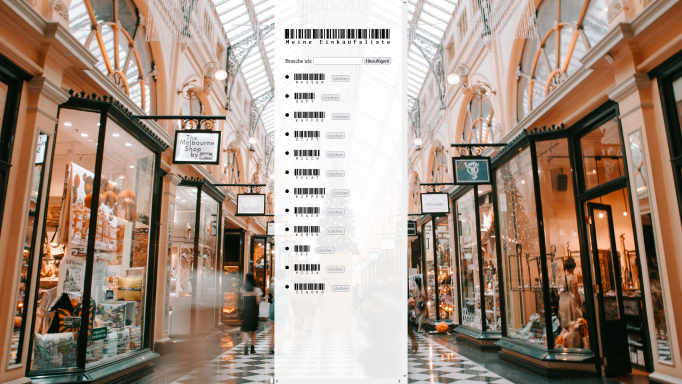

# Einkaufsliste
Eine Einkaufsliste in HTML/JS

Gestern Abend habe ich dies hier in einer dunklen Abyss meines Coding-Archivs gefunden: eine Einkaufsliste, die eine Barcode-Schriftart von Google verwendet.

Und jetzt haltet Euch fest: das Teil benutzt IndexedDB, um die Einkaufsliste zu persistieren! 

Offenbar wollte ich damals die Prinzipien von IndexedDB mit einem simplen Speicherobjekt tiefer ergründen. 120 Zeilen Code für einen Speichermechanismus, den man unter Verwendung von Local Storage mit 5 Zeilen gehabt hätte. Aber hey, wenigstens ist der Code auch kommentiert. ;-)

Um die "App" in ihrer ganzen ursprünglichen Schönheit zu erfahren, könnt Ihr das Hintergrundbild (welches übrigens von [Heidi Fin](https://unsplash.com/@heidijfin) ist) im "alltainer" auskommentieren.

Habt Spass damit, und forkt das Ding bitte was das Zeug hält, Design-Trash muss leben!